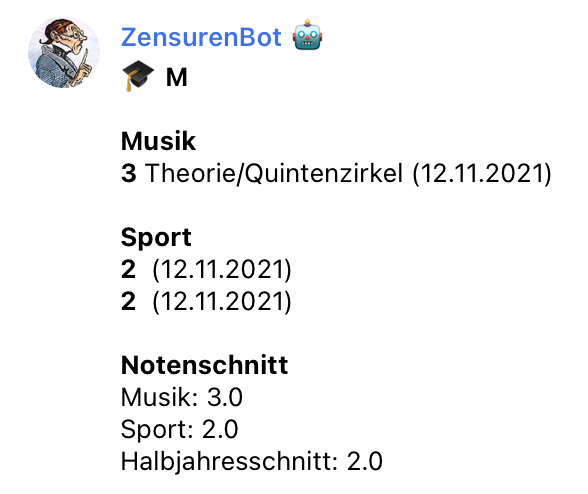

# HipLeech

Downloads grade information from a given cevex **H**ome.**I**nfo**P**oint website. As parent, you have to login manually and check for new grades every now and then. This is tedious, especially with several kids. This program automates the process and allows to poll the site frequently. If new grades are posted, it can post a notification to a Telegram channel.

This is an example of hipleech in action. The new grades are shown, as well as the average grade per course and the average of all courses in the current semester.



## Building

* clone this repo form github
* install the latest swift toolchain from [https://www.swift.org/download/](https://www.swift.org/download/)
* make sure `swiftc` is in your path. It's usually someething like `/home/user/swift-5.5.1-RELEASE-ubuntu20.04/usr/bin` (depens where you installed the swift toolchain)
* `swift build` builds the binary
* the binary can be found at `.build/x86_64-unknown-linux-gnu/debug/HipLeech`,

## Running

You have to run hipleech frequently to detect new grades. This example fetches the grade for two students from the same school (the URL is the same).

```
#!/bin/sh
/home/melle/bin/HipLeech \
   --previousState /home/melle/tmp/hipleech-previous-kid1.json \
   -o markdown \
   -t "telegramToken+chatID" \
   Kid1 username1 password1 \
   "https://www.name-of-the-school.de/homeInfoPoint/"

/home/melle/bin/HipLeech \
   --previousState /home/melle/tmp/hipleech-previous-kid2.json \
   -o markdown \
   -t "telegramToken+chatID" \
   Kid2 username2 password2 \
   "https://www.name-of-the-school.de/homeInfoPoint/"
```

Please note that `--previousState /home/melle/tmp/hipleech-previous-kid1.json` saves the last known grades. The file location has to be unique per student. On the first launch, the file does not exist and all grades are reported as new. On the next launch, only the difference between the saved state and the website is reported.

In order to receive the notifications, create a Telegram channel and add the contacts that should be notified about new grades, like your kids. See [this SO-post](https://stackoverflow.com/questions/33858927/how-to-obtain-the-chat-id-of-a-private-telegram-channel) how to obtain the chat-ID of that channel.

Put this in your crontab to query the portal every 20 minutes:

```
*/20    *       *       *       *       /home/melle/bin/zensurenbot.sh
```


## Usage

The output can be formatted as Ascii, JSON or Markdown. If a JSON-file with the previous grade information is provided, only the diff between the old and the current state is returned. By providing a Telegram API token and a chat ID, it is possible to send the grades to a Telegram bot.


```
Usage:

    $ .build/x86_64-apple-macosx/debug/HipLeech <username> <password> <url>

Arguments:

    username - Username (provided by the school)
    password - Password (provided by the school)
    url - Address of the Home.Infopoint installation, i.e. https://www.name-of-the-school.de/homeInfoPoint/

Options:
    --output [default: ascii] - Output format, either ascii, json or markdown
    --previousState [default: ] - previous state file in json-format
    --token [default: ] - Telegram API token
    --chatID [default: ] - Telegram chat ID (i.e. "-6573342")
    --help - complete usage info
````

